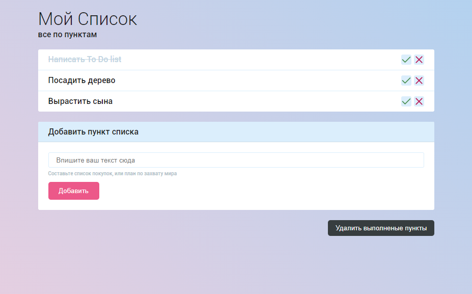

# To Do List
Браузерное приложение для создания различных списков. Подходит для составления списка покупок, дел на день или разбиения на пункты крупной задачи. Помогает эффективнее распоряжаться своим временем и не забывать о важных вещах.

Приложение позволяет отмечать сделанные задачи, добавлять новые или удалять не нужные или уже выполненные пункты. Список задач сохраняется в локальное хранилище браузера.

## Технологии
* JS (vanilla)
* HTML5
* CSS3

## Инструкция по использованию 

### Внесение задачи в список
Изначально список задач пуст. Для добавления новой записи следует воспользоваться секцией для добавления пункта в список. Для этого в поле input нужно ввести текст и нажать кнопку "Добавить". После этого задача попадет в поле списка, а тег с отображением пустого листа будет удален.

### Просмотр текста задачи
Если текст пункта будет выходить за границы тега отображающего задачу в списке, он будет скрыт. Для просмотра полной записи следует единожды по ней кликнуть. Повторный клик скроет текст вернув его вид к укороченному варианту.

### Перевод задачи в статус выполненной
Для отображения задачи как выполненной стоит воспользоваться кнопкой с галочкой в правом углу задачи в секции со списком. При клике задаче будет добавлен класс task-done. При повторном клике класс task-done будет удален и задача вновь отобразится как не выполненная.

### Удаление задачи
Для удаления задачи из списка стоит воспользоваться кнопкой с крестиком в правом углу задачи в секции со списком.

### Удаление всех выполненных задач
Для удаления всех задач имеющих класс task-done следует воспользоваться кнопкой "Удалить выполненные пункты" находящейся под секцией с добавлением новой задачи. 